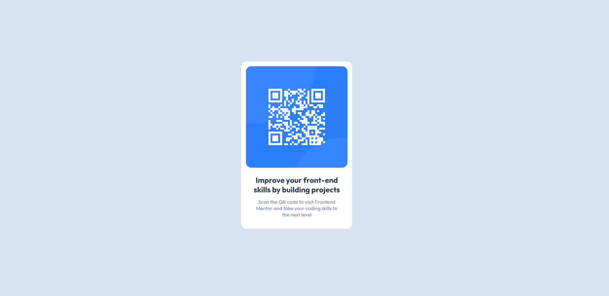

# Frontend Mentor - QR code component solution

This is a solution to the [QR code component challenge on Frontend Mentor](https://www.frontendmentor.io/challenges/qr-code-component-iux_sIO_H). Frontend Mentor challenges help you improve your coding skills by building realistic projects. 

## Table of contents

- [Overview](#overview)
  - [Screenshot](#screenshot)
  - [Links](#links)
- [My process](#my-process)
  - [Built with](#built-with)
  - [What I learned](#what-i-learned)
  - [Useful resources](#useful-resources)
- [Author](#author)

## Overview

I started learning Front end web development on 12/05/22, this is the first challenge I have done and I found it super fun.

### Screenshot



### Links

- Solution URL: [Click me!](https://www.frontendmentor.io/solutions/qr-code-component-d_OYvevQq0)
- Live Site URL: [Click me!](https://johnhaab.github.io/QR-code-component/)

## My process

First I started with adding what I need in index.html to get everything working, then I started my styles.css

### Built with

- Semantic HTML5 markup
- CSS custom properties

### What I learned

I learned how to get a group of items and center it, I was unsure of how to do that prior to this but I can now say I understand it a lot more.

Code snippets, see below:

```html
    <div class="container">
      <div class="card">
  
        <div class="text">
  <h2 class="h2">Improve your front-end skills by building projects</h2>
  <p class="p">Scan the QR code to visit Frontend Mentor and take your coding skills to the next level</p>
        </div>
      </div>
    </div>
```
```css
body {
    background-color: hsl(212, 45%, 89%);
    font-family: 'Outfit', sans-serif;
    min-height: 100vh;
    display: flex;
    align-items: center;
}
```

### Useful resources

- [Padding and margin help](https://forum.freecodecamp.org/t/adding-space-between-h1-h2-h6-and-p/393073) - This helped me get the text spaced out how it needed to be.

## Author

- Frontend Mentor - [@johnhaab](https://www.frontendmentor.io/profile/johnhaab)
- Twitter - [@johnlhaab](https://www.twitter.com/johnlhaab)
